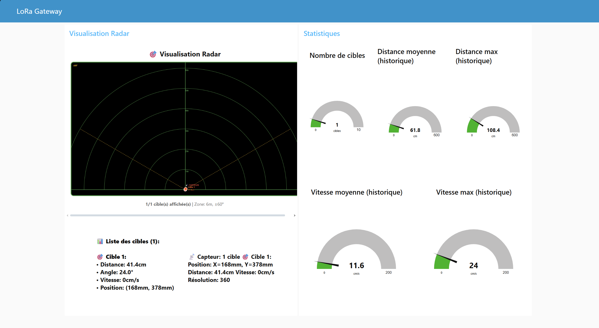

# Gateway LoRa Raspberry Pi 5

Gateway LoRa complète pour Raspberry Pi 5 avec module E220-900T22D (900MHz), compatible avec le protocole ESP32.

**Conforme au TD RPi LoRa Gateway** avec support MQTT, Node-RED, et sécurisation.

## 📋 Matériel nécessaire

1. **Raspberry Pi 5** (modèle recommandé pour ce projet)
2. **Module LoRa E220-900T22D** (900MHz, 22dBm)
3. **Antenne LoRa** (compatible 900MHz)
4. **Carte microSD** (16 Go minimum) avec Raspberry Pi OS installé
5. **Alimentation** pour le Raspberry Pi (5V, 3A recommandé)
6. **Câbles et accessoires** (clavier, souris, écran ou accès SSH)

## 📁 Fichiers du projet

- **`lora_gateway.py`** : Code principal de la gateway (avec support MQTT)
- **`database.py`** : Module de gestion de la base de données SQLite
- **`requirements.txt`** : Dépendances Python
- **`install_mqtt.sh`** : Script d'installation Mosquitto MQTT
- **`install_nodered.sh`** : Script d'installation Node-RED
- **`secure_gateway.sh`** : Script de sécurisation (pare-feu)
- **`node-red-flow.json`** : Flux Node-RED pour visualisation des données
- **`export_to_influxdb.py`** : Script d'export SQLite vers InfluxDB

## 🚀 Installation et configuration

### Étape 1 : Préparer le Raspberry Pi

1. **Installer Raspberry Pi OS** :
   - Téléchargez Raspberry Pi OS depuis le site officiel : https://www.raspberrypi.org/software/
   - Flashez l'image sur la carte microSD avec un outil comme Balena Etcher
   - Insérez la carte microSD dans le Raspberry Pi 5

2. **Configuration initiale** :
   - Allumez le Raspberry Pi et terminez la configuration initiale (langue, réseau, etc.)
   - Configurez l'accès SSH si nécessaire

### Étape 2 : Installer le module LoRa

1. **Connecter le module E220-900T22D** :

| Pin E220 | Pin Raspberry Pi 5 | Description |
|----------|---------------------|-------------|
| VCC | 5V (Pin 2 ou 4) | Alimentation 5V |
| GND | GND (Pin 6, 9, 14, 20, 25, 30, 34, 39) | Masse |
| TX | GPIO 14 (TXD, Pin 8) | TX module → RX Pi |
| RX | GPIO 15 (RXD, Pin 10) | RX module ← TX Pi |
| AUX | GPIO 17 (Pin 11) | Signal AUX (optionnel) |
| M0 | GPIO 22 (Pin 15) | Mode 0 (optionnel) |
| M1 | GPIO 27 (Pin 13) | Mode 1 (optionnel) |

2. **Installer les dépendances système** :

```bash
sudo apt update
sudo apt upgrade -y
sudo apt install -y git python3-pip python3-venv
```

### Étape 3 : Installer le logiciel de la gateway

1. **Télécharger et configurer le projet** :

```bash
cd ~/Documents/TestLora/pi5
python3 -m venv venv
source venv/bin/activate
pip install -r requirements.txt
```

2. **Configuration système** :

#### Activation de l'UART

Sur Raspberry Pi 5, l'UART est généralement activé par défaut. Vérifiez avec :

```bash
ls -l /dev/ttyAMA0
```

Si le fichier n'existe pas, activez l'UART via `raspi-config` :

```bash
sudo raspi-config
# Interface Options → Serial Port → Yes
```

#### Permissions utilisateur

```bash
sudo usermod -aG dialout $USER
```

**Important** : Déconnectez-vous et reconnectez-vous pour que les changements prennent effet.

### Étape 4 : Tester la gateway

1. **Démarrer la gateway** :

```bash
cd ~/Documents/TestLora/pi5
source venv/bin/activate
python3 lora_gateway.py
```

2. **Vérifier la communication** :
   - Utilisez un capteur LoRa ESP32 pour envoyer des données à la gateway
   - Vérifiez que les données sont bien reçues dans le terminal du Raspberry Pi
   - Les messages sont automatiquement stockés dans la base de données SQLite (`lora_messages.db`)

## ⚙️ Configuration de la gateway

La gateway utilise les mêmes paramètres que l'ESP32 (définis dans `src/Config.h`) :

- **Canal**: 23 (873.125 MHz)
- **Baudrate**: 9600
- **TX Power**: 22 dBm
- **Air Data Rate**: 2.4 kbps
- **Chiffrement**: AES-128-CBC (même clé que l'ESP32)

### Types de messages supportés

- **TEMP** (0x01) : Température
- **HUMAN_DETECT** (0x02) : Détection humaine (OUI/NON)
- **HUMAN_COUNT** (0x03) : Nombre de personnes détectées
- **SENSOR_DATA** (0x04) : Données complètes du capteur humain avec cibles (X, Y, vitesse, distance)
- **ENVIRONMENT** (0x09) : Température, pression, humidité
- **TEXT** (0x10) : Messages texte
- **PING/PONG** (0x20/0x21) : Messages de test

## 🔧 Fonctionnalités

✅ Réception de messages LoRa depuis ESP32  
✅ Stockage dans SQLite avec horodatage  
✅ Publication MQTT (optionnel)  
✅ Visualisation Node-RED (optionnel)  
✅ Sécurisation avec pare-feu  
✅ Support de tous les types de messages ESP32

## 📊 Base de données

Les messages sont automatiquement stockés dans `lora_messages.db` (SQLite).

Consultation :

```bash
sqlite3 lora_messages.db "SELECT * FROM messages ORDER BY timestamp DESC LIMIT 10;"
```

## 📡 Configurer un réseau local avec MQTT

1. **Installer un serveur MQTT** :

```bash
./install_mqtt.sh
```

Ou manuellement :

```bash
sudo apt install -y mosquitto mosquitto-clients
sudo systemctl enable mosquitto
sudo systemctl start mosquitto
```

2. **Relier la gateway à MQTT** :

```bash
python3 lora_gateway.py --mqtt
```

Les messages seront publiés sur le topic `lora/data` (configurable via `--mqtt-topic`).

### Test MQTT

**Terminal 1** (subscribe) :
```bash
mosquitto_sub -h localhost -t "lora/data" -v
```

**Terminal 2** (gateway) :
```bash
python3 lora_gateway.py --mqtt
```

## 📊 Visualiser les données avec Node-RED

1. **Installer Node-RED** :

```bash
./install_nodered.sh
```

Ou manuellement :

```bash
bash <(curl -sL https://raw.githubusercontent.com/node-red/linux-installers/master/deb/update-nodejs-and-nodered)
sudo systemctl enable nodered.service
sudo systemctl start nodered.service
```

2. **Installer @flowfuse/node-red-dashboard** :

Le script `install_nodered.sh` installe automatiquement `@flowfuse/node-red-dashboard`. Si vous avez installé Node-RED manuellement :

```bash
cd ~/.node-red
npm install @flowfuse/node-red-dashboard
sudo systemctl restart nodered.service
```

Ou via l'interface Node-RED :
- Menu (☰) → **Manage palette** → **Install**
- Recherchez `@flowfuse/node-red-dashboard` et installez-le

3. **Configurer le flux Node-RED** :

   - Accédez à Node-RED : http://localhost:1880
   - Menu (☰) → **Import** → Sélectionnez `node-red-flow.json`
   - Cliquez sur **Deploy**
   - Accédez au tableau de bord : http://localhost:1880/ui

### Fonctionnalités du dashboard

- **Température** : Jauge visuelle avec température en temps réel
- **Environnement** : Température, pression et humidité
- **Détection humaine** : État de détection (OUI/NON)
- **Comptage** : Nombre de personnes détectées
- **Capteur humain (SENSOR_DATA)** : 
  - Détails textuels des cibles avec position, distance, vitesse
  - **Visualisation radar interactive** : Mini radar 2D affichant les cibles en temps réel
    - Zone de détection : 6 mètres, ±60°
    - Cibles affichées avec leurs coordonnées X, Y
    - Lignes de connexion vers le capteur
    - Couleurs différentes pour chaque cible
- **Messages texte** : Messages texte reçus
- **Historique des messages** : Vue d'ensemble de tous les messages avec détails complets



### Autres outils de visualisation

```bash
python3 export_to_influxdb.py
```

## 🔒 Sécuriser la gateway

1. **Changer les mots de passe par défaut** :

```bash
passwd
```

2. **Configurer un pare-feu** :

```bash
./secure_gateway.sh
```

Ou manuellement :

```bash
sudo apt install -y ufw
sudo ufw allow ssh
sudo ufw allow 1883/tcp  # MQTT (si utilisé)
sudo ufw allow 1880/tcp  # Node-RED (si utilisé)
sudo ufw --force enable
```

## 🔧 Options de ligne de commande

```bash
python3 lora_gateway.py --help
```

Options principales :
- `--device`: Port série (défaut: `/dev/ttyAMA0`)
- `--baudrate`: Vitesse de transmission (défaut: `9600`)
- `--channel`: Canal LoRa (défaut: `23` = 873.125 MHz)
- `--aux-pin`: GPIO relié à AUX (défaut: `17`)
- `--m0-pin`: GPIO relié à M0 (défaut: `22`)
- `--m1-pin`: GPIO relié à M1 (défaut: `27`)
- `--db`: Chemin base de données (défaut: `lora_messages.db`)
- `--mqtt`: Activer la publication MQTT
- `--mqtt-host`: Adresse du broker MQTT (défaut: `localhost`)
- `--mqtt-port`: Port du broker MQTT (défaut: `1883`)
- `--mqtt-topic`: Topic MQTT (défaut: `lora/data`)
- `--mqtt-username`: Nom d'utilisateur MQTT (optionnel)
- `--mqtt-password`: Mot de passe MQTT (optionnel)

## 🐛 Dépannage

### Le port série n'est pas accessible

```bash
# Vérifier que le port existe
ls -l /dev/ttyAMA0

# Vérifier les permissions
groups $USER  # doit contenir "dialout"

# Si dialout n'est pas dans la liste
sudo usermod -aG dialout $USER
# Puis se déconnecter/reconnecter
```

### Messages non reçus

1. Vérifiez que le canal est identique entre l'ESP32 et la Pi (23 par défaut)
2. Vérifiez l'antenne
3. Vérifiez les connexions matérielles
4. Vérifiez la distance (portée limitée)

### MQTT ne fonctionne pas

```bash
# Vérifier que Mosquitto est démarré
sudo systemctl status mosquitto

# Tester avec mosquitto_sub
mosquitto_sub -h localhost -t "lora/data" -v
```

### Node-RED ne s'affiche pas

```bash
# Vérifier que Node-RED est démarré
sudo systemctl status nodered

# Vérifier les logs
sudo journalctl -u nodered -f
```

## ✅ Résultat final

Vous avez maintenant une gateway LoRa locale fonctionnelle qui peut :

- ✅ Recevoir des données de capteurs LoRa ESP32 (900MHz)
- ✅ Décoder tous les types de messages (température, détection humaine, cibles radar, etc.)
- ✅ Stocker les données dans une base SQLite avec horodatage
- ✅ Transmettre les données à un serveur MQTT local
- ✅ Visualiser les données avec Node-RED
- ✅ Créer un réseau IoT privé pour des applications comme la domotique, l'agriculture ou la surveillance industrielle

## ✅ Compatibilité

- ✅ Raspberry Pi 5
- ✅ Module E220-900T22D (900MHz)
- ✅ Protocole ESP32 (chiffrement AES-128-CBC)
- ✅ Stockage SQLite avec horodatage
- ✅ Tous les types de messages ESP32
- ✅ Décodage complet des données du capteur humain (SENSOR_DATA)
